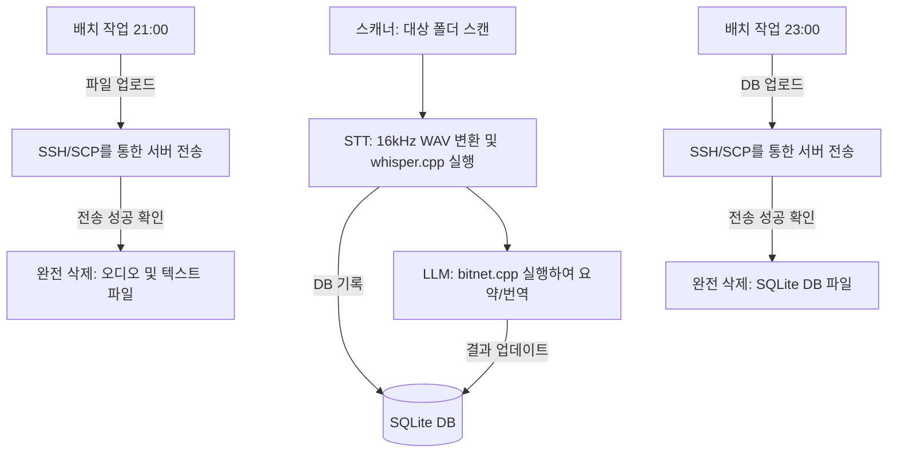

# AMEVA Edge Agent

> **[프로젝트 요약 (Resume Profile)]**
> 
> * **① 제목:** 엣지-호스트 연동 및 물리 소거 동기화 파이프라인 (AMEVA Edge Agent)
> * **② 주제:** 
>   * 극도로 보안이 강조되는 기기(모바일 Termux 등)에서 정보 유출을 차단하며 오디오·STT·요약 결과를 안전하게 전송하고 잔여 흔적을 소거하는 라이프사이클 지향
>   * 엣지용 `AudioScanner`·`STTEngine`·`SSHSyncManager` 스케줄러와 호스트 측 `HostDBManager`·`watchdog` 데몬 간의 비동기 마이그레이션 협업 구현
>   * 모바일 기기의 불안정한 외부 패키지 설치와 네트워크 가용 한계, 그리고 삭제된 파일의 포렌식 복구 위협을 방지하기 위한 보안 소거 및 경량 아키텍처 구현
> * **③ 내용요지:**
>   * **사용 기술:** `Python 3` (표준 라이브러리 100% 준수 - 엣지용), `watchdog`, `reportlab`, `requests`, `sqlite3`, `subprocess`
>   * **사용 모델:** `Whisper.cpp (Small)` (STT), `Llama-3 (8B, BitNet 1.58b)`, `Llama-3.2 (3B)` (LLM)
>   * **핵심 알고리즘:** 디렉토리 실시간 감시를 위한 `watchdog` 기반 인입 감지, 파일 유출을 방지하는 `shred_file` 및 `shred_database` 포렌식 완전 소거 알고리즘, 트랜잭션 안전성 확보를 위한 마스터 DB 병합(`merge_edge_db`), 1:1:1 물리 파일 교차 검증 (`validate_sync_integrity`), 핑 기반 네트워크 대역폭 체크 (`check_network_condition`)
>   * **에이전트/보안 제어 (또는 핵심 아키텍처 흐름):** 엣지에서 미디어 파일 스캔 및 sqlite 데이터 적재 -> STT/LLM 요약 완료 대기 -> 21시 배치 기동 -> 네트워크 대역폭 판별 -> SCP 파일 업로드 및 ssh 원격 크기 검증 -> 검증 성공 시 `shred_file`로 로컬 파일 복구 불가능 소거 -> 23시 배치 기동 -> 마이그레이션용 복제 DB 전송 -> 호스트 watchdog 감지 -> Master DB 트랜잭션 개시 후 병합 및 1:1:1 파일 교차 검증 -> 호스트가 성공 시그널 반환 시 엣지 원본 DB 완전 삭제 흐름
>   * **연구 성과:** 엣지 에이전트의 종속성을 파이썬 표준 라이브러리만으로 100% 구축하여 가용 환경을 극대화하고, 데이터 전송 직후 로컬 파일 데이터에 포렌식 소거를 집행하여 단 1바이트의 기밀 유출 가능성도 원천 차단
> * **④ 기여도:** 단독 개발 (100% - 아키텍처 설계, 보안 시스템 구축, 코어 로직 구현 전담)

# AMEVA Edge Agent

AMEVA Edge Agent는 안드로이드 기기 환경에서 생성된 음성 파일을 인식하고 텍스트로 변환한 뒤 요약하여 원격 서버로 안전하게 전송하는 자동화 파이프라인 프로그램입니다.

---

---

## 3. 아키텍처 흐름도

## 4. 주요 기능 및 역할

### 1. 파일 탐색 및 등록 기능
기기 내부에 저장된 새로운 음성 파일을 자동으로 찾아내어 데이터베이스에 작업 대상으로 등록하는 역할을 수행합니다.

### 2. 음성 텍스트 변환 기능

음성 인식 알고리즘을 활용하여 수집된 음성 파일의 소리 데이터를 문자 형태의 텍스트 데이터로 변환하는 역할을 수행합니다.

### 3. 내용 요약 및 번역 기능

언어 처리 알고리즘을 통해 텍스트로 변환된 대화 내용을 분석하고, 가장 중요한 핵심 내용을 도출하여 요약본을 작성하는 역할을 수행합니다.

### 4. 보안 전송 및 완전 소거 기능

작업이 끝난 텍스트 파일과 음성 파일, 그리고 데이터베이스 기록을 원격 서버로 안전하게 전송합니다. 전송이 성공적으로 끝나면 로컬 기기에 남아있는 원본 데이터를 포렌식 기법으로도 복구할 수 없도록 완전히 삭제하는 보안 역할을 수행합니다.

### 5. 자동화 스케줄링 및 모니터링 역할

사용자가 매번 명령을 내리지 않아도 정해진 시간표에 따라 전체 기능과 알고리즘이 순차적으로 실행되도록 파이프라인 전체 프로세스를 관리하고 감시하는 역할을 수행합니다.

## 5. 실행 방법

메인 스크립트(main.py)를 실행하면 대화형 메뉴가 제공되며, 각 기능을 개별적으로 작동시키거나 전체 프로세스를 백그라운드에서 자동으로 돌아가게 설정할 수 있습니다.

1. 오디오 파일 스캔 및 데이터 등록
2. 음성 텍스트 변환 진행
3. 텍스트 내용 요약 진행
4. 파일 원격 전송 및 완전 소거
5. 데이터베이스 원격 전송 및 완전 소거
6. 자동화 모니터링 기능 가동

## 9. 연락처 (Contact)

저는 Multi-Agent Systems, Edge Computing, 그리고 AI SRE 분야에 대한 학술적 담론을 언제나 환영합니다.

- **GitHub**: [@uno-km](https://github.com/uno-km)
- **Email**: zhfldk014745@naver.com
- **Tstory**: [my-blog](https://uno-kim.tistory.com/)
- **Research Focus**: Hierarchical AI Orchestration, Edge-native Inference, Data Sovereignty
- **Generated by AMEVA Researcher Portfolio Builder**

*Last Updated: June 9, 2026*

---

*빅테크의 클라우드 종속을 거부하고, 온프레미스 자율 지능의 독립과 생존을 실증합니다.*
